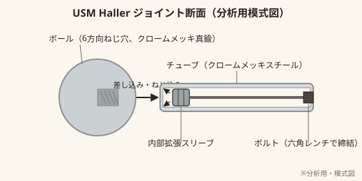
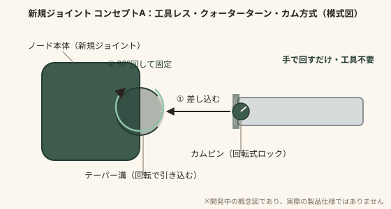

# USM Haller ジョイント分析と次世代ジョイント コンセプト

「USM Haller の次世代版」を目指し、同等の使い勝手・普遍性を持ちながら機構的に独自の、特許取得を目指すジョイント金具を開発するための技術資料。

- **起票日**: 2026-09-18
- **ステータス**: コンセプト検討初期（先行技術調査・弁理士相談前）
- **関連資料**: [../01_PRODUCTS/SYSTEM_FURNITURE_CONCEPT.md](../01_PRODUCTS/SYSTEM_FURNITURE_CONCEPT.md)（合板パネル×カムロックの旧コンセプト。本ドキュメントで方向性を更新 — 4章参照）

> ⚠️ **取り扱い注意**: 本資料は特許出願前の技術検討である。[README.md](./README.md) の「取り扱い上の注意」を必ず確認し、社外への共有は NDA 締結後に限ること。

## 1. 背景・目的

USM Haller はサイズ・比率・拡張の思想はそのままに、接合部（ジョイント）だけを独自開発し直すことで「USM Haller の次世代版」を作りたい、という方針。

- チューブ・モジュールのサイズ感は USM 相当を踏襲する（同じ「世界観のスケール」で拡張できることを優先し、寸法の刷新は行わない）。
- ジョイント金具そのものを新規に開発し、特許を取得する。
- 思想は前回と同じ：拡張性・エレガンス・普遍性・カフェでの気軽さ・オフィスへの新提案・シンプルさ（[SYSTEM_FURNITURE_CONCEPT.md](../01_PRODUCTS/SYSTEM_FURNITURE_CONCEPT.md) 3章の6原則を継承）。「永く使えるモデル」であることが最重要。

## 2. USM Haller ジョイントの技術分析

*図: USM Haller の接合機構（分析用模式図）。実際の寸法・形状を正確に再現したものではない。*

### 2.1 構成

- 中心部品は**クロームメッキ真鍮製のボール**。直径約25mm、重量約47gという非常に小さく軽い部品でありながら、システム全体の要となっている。
- ボールには**6方向・90°間隔でねじ穴**が切られており、ここに**クロームメッキスチール製のチューブ**（全11種の長さ展開）をねじ込むことで、上下左右前後、自由な方向にフレームを組める。

### 2.2 締結原理

- 外観からは締結具（ネジ頭など）が一切見えない。これは、**チューブの内部に隠されたボルトと拡張スリーブ**が締結を担っているため。
- チューブ内部のボルトを（チューブの反対側の開口から）**六角レンチで締め込む**と、内部のスリーブが左右に拡張し、チューブ内壁とボールのねじ穴内面の両方に圧着して固定される。
- この「内部拡張スリーブ方式」が、USM Haller の意匠的な美しさ（金具が見えない、無骨にならない）を支えている中核メカニズムである。

### 2.3 特許状況（参考情報）

- 1965年、Paul Schärer 氏がこのボールジョイントの特許を出願している。
- 出願から60年以上が経過しており、主要国の特許保護期間（通常は出願から最長20年程度）はいずれも満了しているため、**この設計自体は技術的にはパブリックドメイン**と考えられる。
- ただし、外観をそのまま模倣することは、意匠権・不正競争防止法上の「周知な商品形態の混同惹起」リスクなど、特許とは別の法的論点が残る。今回の目的はそもそも模倣ではなく、**機構的に異なる新しいジョイントを独自開発すること**にあるため、この点は設計方針（4章以降）で自然に回避される。

### 2.4 USM の本質的価値の理解

ジョイントの巧妙さそのものよりも、**「同一の接合ルールだけで棚・収納・デスク・パーティションまで際限なく拡張できる」というシステム思想**こそが USM Haller の本質的価値であり、60年間モデルチェンジせず売れ続けている理由でもある。次世代ジョイントの開発においても、この思想（少ない部品種類・単一の接合ルール・永遠に拡張できる）を最優先で継承する。

## 3. 次世代ジョイントの要求仕様

| # | 要求 | 理由 |
|---|---|---|
| 1 | 丸チューブを最大6方向・90°間隔で接合できる | USM 同等の拡張自由度を確保するため |
| 2 | チューブ径・ノードの見た目のスケール感は USM 相当を踏襲する | 「同じサイズ感」というユーザー要件、既存什器との違和感のなさ |
| 3 | 締結機構が USM の「内部拡張スリーブ＋六角レンチ」と機構的に異なること | 独自性・特許性の確保（模倣ではなく新規発明であること） |
| 4 | 可能であれば USM より組立が簡単（工具レス）であること | 機能的優位性＝特許の進歩性（inventive step）の裏付けになりやすい |
| 5 | 外観に締結具が露出しない、またはあえて見せる場合はそれ自体を意匠として美しく見せる | エレガンス・USM同等以上の意匠性 |
| 6 | ガタつきなく高い剛性を確保し、着脱を繰り返しても緩まない | 「永く使えるモデル」という要件、什器としての信頼性 |
| 7 | 量産可能な工法（ダイキャスト・削り出し等）で製造できる | 事業として現実的なコストで作れること |

## 4. 素材構成の方針転換（前回コンセプトとの関係）

前回検討した「合板パネル × カムロック接合」（[SYSTEM_FURNITURE_CONCEPT.md](../01_PRODUCTS/SYSTEM_FURNITURE_CONCEPT.md)）は、USM のようなチューブ＋ノードのフレーム構造ではなく、板と板を直接つなぐ棚ボックス的な構造を想定したものだった。

USM の次世代版を目指す今回の方針では、**USM と同じ「チューブ＋ノード」のフレーム構造を採用**する。その上で、ahum.organics らしい差別化として、

- **ノード（接合部）** は自社開発の新規ジョイント（本ドキュメントの主題）
- **フレームに掛ける天板・棚板・パーティション面材** に合板を使い、USM のスチールパネルにはない木の温かみを持たせる

という組み合わせで、「USMの拡張思想＋独自ジョイントの特許性＋合板の質感」を同時に満たす方向にアップデートする。カムロック接合による板同士の直接接合は、天板やパネルをフレームに取り付ける補助的な用途としては引き続き使える可能性があるが、システムの主構造はチューブ＋ノードに一本化する。

## 5. 新規ジョイント候補メカニズム

USM の「ねじ込み式ボール＋内部拡張スリーブ」とは異なる締結原理を軸に、4つの方向性を検討した。

| 案 | 締結原理 | 工具 | 特徴 |
|---|---|---|---|
| **A. クォーターターン・カム方式**（推奨） | チューブ先端のカムピンを、ノード内部のテーパー溝に沿って回転させ、回転しながら軸方向に引き込んで固定する | 不要（手回しのみ） | USMより組立が速く工具レス。外観はフラットで金具が見えない。USMの「ねじ込み＋内部拡張」とは原理が明確に異なる。 |
| B. プッシュロック・コレット方式 | チューブ先端のスプリングコレットが差し込むだけでノード内部の溝にかみ込み、解除ボタンを押すと外れる（ワンタッチ着脱） | 不要 | 着脱が最速。ただし家具として必要な「ガタのなさ・曲げ剛性」を確保するための二次ロック（テーパー圧着など）の設計難度が高い。 |
| C. 外部圧着カラー方式（ユニオン式） | チューブ外側の目立たないリング（カラー）を手で締め込み、テーパーフェルールをノードとチューブの両方に圧着させる | 不要（手締め） | 配管のユニオン継手に近い原理。カラー自体を意匠要素として見せる／馴染ませるデザインの工夫が必要。 |
| D. バヨネット＋ディテント方式 | カメラマウントのように、チューブ側の爪をノードのJ字溝に差し込んで回転させ、スプリングピンで抜け止めする | 不要 | 高速な脱着に強い。荷重がかかった時に自己増し締めする形状にできれば剛性面の弱点を補える。 |

### 選定理由（案A: クォーターターン・カム方式を推奨）

- **意匠性**: 外観に露出する金具がなく、USM 同様「金具が見えない」というエレガンスの原則を維持できる。
- **機能的優位性**: USM は締結に六角レンチが必要（完全な工具レスではない）。案Aは「差し込んで90°回すだけ」で完結し、組立体験そのものが USM を上回る改善点になる。特許の「進歩性」を主張しやすい具体的な差別化ポイント。
- **機構の明確な違い**: USM の「ねじ込み＋内部拡張スリーブ」に対し、案Aは「カムによる回転引き込み」であり、締結原理そのものが異なる。
- 案B・C・Dは剛性・意匠・製造難度のいずれかに課題が残るため、当面はセカンダリ候補として並行して情報収集を続ける。

*図: コンセプトA（クォーターターン・カム方式）の模式図。差し込んで90°回すと、カムピンがテーパー溝に沿って引き込まれ、チューブがノードに締結される。あくまで概念図であり、実際の寸法・公差・強度は未検証。*

## 6. 知財戦略・注意事項（重要）

- **本資料はエンジニアリング面のアイデア出しであり、特許性・侵害リスクについての法的判断ではない。** 出願前に必ず弁理士による正式な先行技術調査（日本国内: J-PlatPat、海外: WIPO PATENTSCOPE・USPTO・EPO等）とクレーム設計を行うこと。
- 家具・什器の接合金具という領域は、バヨネットマウント、カムロック、プッシュロック（クイックコネクト）、空間フレーム用ノード（例: MERO系）など、隣接分野を含めると先行技術が非常に多い。「USMと違う」だけでは特許性の根拠として不十分で、専門家によるクレーム設計で新規性・進歩性のある具体的な構成に絞り込む必要がある。
- **出願前の公開は新規性を喪失させるリスクがある。** 石巻工房などの製作パートナー候補を含め、社外に見せる際は必ず秘密保持契約（NDA）を締結してから行うこと。日本の特許法には自己都合の公開から一定期間内であれば新規性喪失の例外を主張できる制度（特許法30条）もあるが、手続き要件が厳格なため、こちらも弁理士に確認してから運用すること。
- ジョイントの外観形状そのものについては、特許（機構の発明）とは別に、**意匠登録**での保護も選択肢になる。あわせて弁理士に相談する。

## 7. 次のアクション

- [ ] 弁理士に相談し、案A（クォーターターン・カム方式）を中心に先行技術調査を依頼する
- [ ] 案A・B・C・Dについて、簡単な強度・公差の目安（外注前の自社検討）を整理する
- [ ] 3Dプリントによる簡易モックアップで、差し込み・回転・引き込みの動作を検証する
- [ ] 石巻工房など第三者に見せる場合に備え、秘密保持契約（NDA）のひな形を用意する
- [ ] 出願スケジュール（国内優先出願 → 12ヶ月以内に海外展開をPCT出願で検討）の草案を弁理士と作成する

## 参考情報源

- [USM Haller System（USM 公式）](https://www.usm.com/ja-jp/collections/usm-haller-system)
- [Our Story | USM（USM公式・沿革）](https://www.usm.com/en/about/our-story)
- [smow: USM Haller Boardsysteme（技術解説PDF）](https://www.smow.de/pdf/USM_Haller_Boardsysteme_en.pdf)
- [Anatomy of a Classic: USM Haller Modular Furniture | Valet.](https://valetmag.com/living/interiors/2024/usm-haller-modular-furniture-anatomy-of-a-classic-061224.php)
- [USM Haller: Indestructible Modular System – Rarify](https://rarify.co/blogs/understand-20th-century-design/usm-haller-modular-system-for-flexible-living)

> 上記の技術情報・特許出願年はウェブ検索による一般情報であり、正式な設計・出願の判断には一次資料（特許公報原文など）の確認と弁理士の見解が必要。
